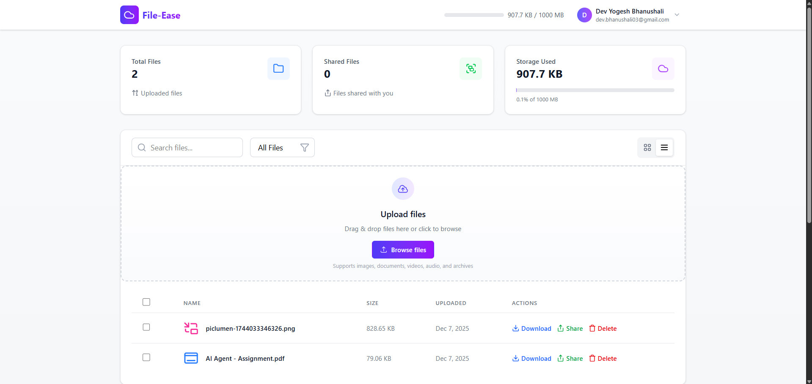
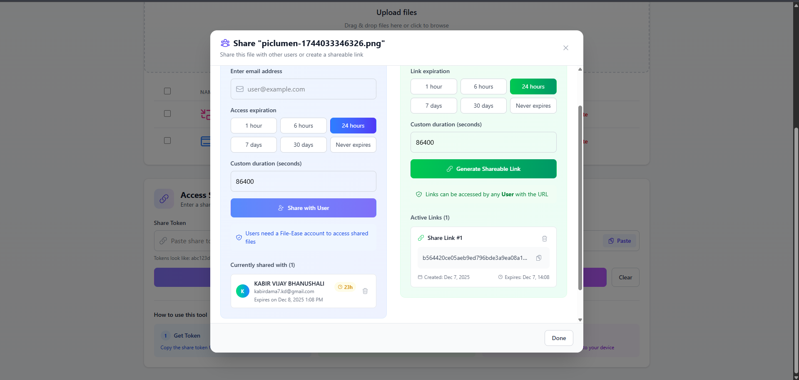

# Secure Drive Frontend

## Overview

Frontend for the Secure File-Sharing application, built using React + Vite.
Features include:

- User login/signup with JWT auth
- Dashboard to view uploaded files
- Copyable shareable token links
- File preview (metadata)
- Download files via access token

Setup
1. Install dependencies
``` npm install ```

2. Add .env file

3. Run the frontend
```npm run dev```

App will run at:
http://localhost:5173

# Screenshots




